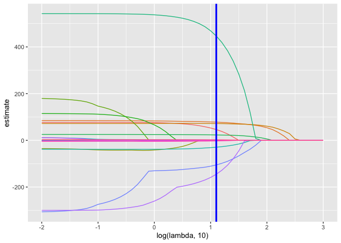
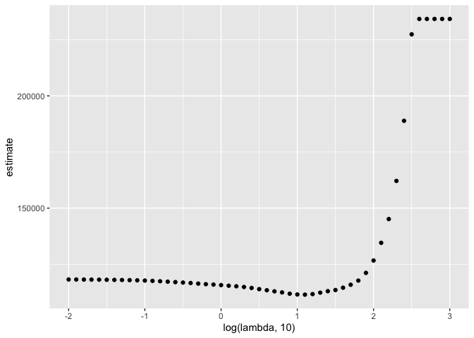

Statistical Learning
================

``` r
library(tidyverse)
```

    ## ── Attaching core tidyverse packages ──────────────────────── tidyverse 2.0.0 ──
    ## ✔ dplyr     1.1.3     ✔ readr     2.1.4
    ## ✔ forcats   1.0.0     ✔ stringr   1.5.0
    ## ✔ ggplot2   3.4.4     ✔ tibble    3.2.1
    ## ✔ lubridate 1.9.2     ✔ tidyr     1.3.0
    ## ✔ purrr     1.0.2     
    ## ── Conflicts ────────────────────────────────────────── tidyverse_conflicts() ──
    ## ✖ dplyr::filter() masks stats::filter()
    ## ✖ dplyr::lag()    masks stats::lag()
    ## ℹ Use the conflicted package (<http://conflicted.r-lib.org/>) to force all conflicts to become errors

``` r
library(glmnet)
```

    ## Loading required package: Matrix
    ## 
    ## Attaching package: 'Matrix'
    ## 
    ## The following objects are masked from 'package:tidyr':
    ## 
    ##     expand, pack, unpack
    ## 
    ## Loaded glmnet 4.1-8

``` r
set.seed(11)
```

\##Lasso

To illustrate the lasso, we’ll data from a study of factors that affect
birthweight. The code chunk below loads and cleans these data, converts
to factors where appropriate, and takes a sample of size 200 from the
result.

``` r
bwt_df = 
  read_csv("data/birthweight.csv") |> 
  janitor::clean_names() |>
  mutate(
    babysex = as.factor(babysex),
    babysex = fct_recode(babysex, "male" = "1", "female" = "2"),
    frace = as.factor(frace),
    frace = fct_recode(
      frace, "white" = "1", "black" = "2", "asian" = "3", 
      "puerto rican" = "4", "other" = "8"),
    malform = as.logical(malform),
    mrace = as.factor(mrace),
    mrace = fct_recode(
      mrace, "white" = "1", "black" = "2", "asian" = "3", 
      "puerto rican" = "4")) |> 
  sample_n(200)
```

    ## Rows: 4342 Columns: 20
    ## ── Column specification ────────────────────────────────────────────────────────
    ## Delimiter: ","
    ## dbl (20): babysex, bhead, blength, bwt, delwt, fincome, frace, gaweeks, malf...
    ## 
    ## ℹ Use `spec()` to retrieve the full column specification for this data.
    ## ℹ Specify the column types or set `show_col_types = FALSE` to quiet this message.

``` r
bwt_df
```

    ## # A tibble: 200 × 20
    ##    babysex bhead blength   bwt delwt fincome frace      gaweeks malform menarche
    ##    <fct>   <dbl>   <dbl> <dbl> <dbl>   <dbl> <fct>        <dbl> <lgl>      <dbl>
    ##  1 male       34      50  3459   124      25 black         35.9 FALSE         13
    ##  2 female     35      51  3827   130      45 white         41.3 FALSE         12
    ##  3 male       33      49  3033   117      65 white         38.9 FALSE         14
    ##  4 female     35      51  3232   136      85 white         42.4 FALSE         11
    ##  5 female     34      49  3118   126      25 black         38.7 FALSE         13
    ##  6 female     32      50  2551   111      25 puerto ri…    35.9 FALSE         13
    ##  7 male       34      51  2835   136      75 white         41   FALSE         14
    ##  8 male       33      48  2495   113      25 black         38.7 FALSE         13
    ##  9 female     35      51  3203   183      15 black         39.4 FALSE         15
    ## 10 female     33      47  2807   136      25 white         39.4 FALSE         12
    ## # ℹ 190 more rows
    ## # ℹ 10 more variables: mheight <dbl>, momage <dbl>, mrace <fct>, parity <dbl>,
    ## #   pnumlbw <dbl>, pnumsga <dbl>, ppbmi <dbl>, ppwt <dbl>, smoken <dbl>,
    ## #   wtgain <dbl>

get predictors and outcome.

To fit a lasso model, we’ll use glmnet. This package is widely used and
broadly useful, but predates the tidyverse by a long time. The interface
asks for an outcome vector y and a matrix of predictors X, which are
created next. To create a predictor matrix that includes relevant dummy
variables based on factors, we’re using model.matrix and excluding the
intercept

``` r
x = model.matrix(bwt ~ ., bwt_df)[,-1]
y = bwt_df |> pull(bwt)
```

We fit the lasso model for each tuning parameter in a pre-defined grid
lambda, and then compare the fits using cross validation. I chose this
grid using the trusty “try things until it looks right” method; glmnet
will pick something reasonable by default if you prefer that.

``` r
lambda = 10^(seq(3, -2, -0.1))

lasso_fit =
  glmnet(x, y, lambda = lambda)

lasso_cv =
  cv.glmnet(x, y, lambda = lambda)

lambda_opt = lasso_cv$lambda.min
```

lasso_cv = we are doing lasso cross validation

The plot below shows coefficient estimates corresponding to a subset of
the predictors in the dataset – these are predictors that have non-zero
coefficients for at least one tuning parameter value in the pre-defined
grid. As lambda increases, the coefficient values are shrunk to zero and
the model becomes more sparse. The optimal tuning parameter, determined
using cross validation, is shown by a vertical blue line.

``` r
lasso_fit |> 
  broom::tidy() |> 
  select(term, lambda, estimate) |> 
  complete(term, lambda, fill = list(estimate = 0) ) |> 
  filter(term != "(Intercept)") |> 
  ggplot(aes(x = log(lambda, 10), y = estimate, group = term, color = term)) + 
  geom_path() + 
  geom_vline(xintercept = log(lambda_opt, 10), color = "blue", size = 1.2) +
  theme(legend.position = "none")
```

    ## Warning: Using `size` aesthetic for lines was deprecated in ggplot2 3.4.0.
    ## ℹ Please use `linewidth` instead.
    ## This warning is displayed once every 8 hours.
    ## Call `lifecycle::last_lifecycle_warnings()` to see where this warning was
    ## generated.

<!-- -->

show the CV result This is relatively shallow – having nothing at all in
your model isn’t great, but you can get reasonable predictions from
models that have “too many” predictors.

``` r
lasso_cv |> 
  broom::tidy() |> 
  ggplot(aes(x = log(lambda, 10), y = estimate)) + 
  geom_point()  
```

<!-- -->
